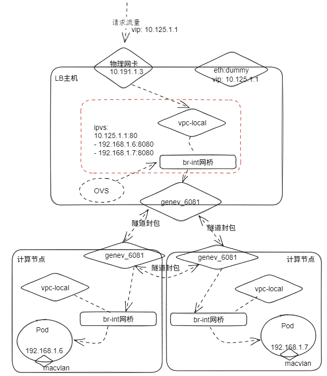

# XDP 集群转发项目

基于 eBPF/XDP 的高性能集群转发系统。

## 为什么选择 XDP？

XDP（Express Data Path）是 Linux 内核的一项特性，允许在网络栈的最早阶段对数据包进行可编程处理——在内核主网络栈处理数据包之前。这为数据包转发提供了接近原生性能的处理能力。

### 核心特性

- **内核旁路** - 在内核网络栈之前处理数据包
- **零拷贝转发** - 使用 AF_XDP 直接 DMA 到用户空间
- **基于流的分发** - 使用类似 RSS 的哈希进行负载均衡
- **内核加速** - 使用 eBPF map 实现快速查找

### 应用场景

- 负载均衡器（L4/L7）
- DDoS 防护
- 防火墙
- 网络流量分析
- Service Mesh Sidecar

## 网络拓扑



### 组件说明

| 组件 | IP 地址 | 说明 |
|------|---------|------|
| **客户端** | 任意 | 发送请求到 VIP |
| **VIP (eth0)** | 192.168.88.10 | 虚拟 IP，接收外部流量 |
| **XDP 程序** | - | 加载到内核的 eBPF 程序，在网卡层面处理数据包 |
| **后端网卡 (eth1)** | 192.168.89.10 | 连接后端服务器的内网接口 |
| **后端服务器 1** | 192.168.89.101:8080 | 真实后端服务 #1 |
| **后端服务器 2** | 192.168.89.102:8080 | 真实后端服务 #2 |
| **后端服务器 3** | 192.168.89.103:8080 | 真实后端服务 #3 |

## 工作原理

### 数据包处理流程

```
┌─────────────────┐
│   数据包到达     │
│   网卡接收      │
└────────┬────────┘
         │
         ▼
┌─────────────────┐
│  XDP 钩子点     │  ← 首次处理数据包的机会
│  (驱动层)       │
└────────┬────────┘
         │
         ▼
┌─────────────────┐
│  解析数据包     │  ← 提取头部（以太网、IP、TCP/UDP）
└────────┬────────┘
         │
         ▼
┌─────────────────┐
│  流表查找       │  ← 检查连接是否存在于流表中
└────────┬────────┘
         │
    ┌────┴────┐
    │         │
    ▼         ▼
┌───────┐ ┌───────┐
│ 新建  │ │ 已知  │
│ 连接  │ │ 连接  │
└───┬───┘ └───┬───┘
    │         │
    ▼         ▼
┌───────────┐ ┌───────────┐
│ 选择      │ │ 从 Map   │
│ 后端      │ │ 获取后端  │
│ (RR/哈希) │ │           │
└───┬───────┘ └─────┬─────┘
    │               │
    └───────┬───────┘
            │
            ▼
┌─────────────────┐
│  重定向到后端   │  ← 通过 XDP_TX 或 devmap 发送
└────────┬────────┘
         │
         ▼
┌─────────────────┐
│  更新统计       │  ← 记录数据包/字节计数
└─────────────────┘
```

### 步骤详解

1. **数据包到达**
   - 网卡接收数据包
   - XDP 程序首先访问数据包

2. **头部解析**
   - 解析以太网头部 → 获取协议类型
   - 解析 IP 头部 → 获取源/目标 IP
   - 解析 TCP/UDP 头部 → 获取源/目标端口
   - 提取 5 元组：(协议, 源IP, 目标IP, 源端口, 目标端口)

3. **流表查找**
   - 使用 5 元组哈希在 eBPF map 中查找
   - 找到 → 使用现有后端
   - 未找到 → 使用轮询或哈希选择新后端

4. **后端选择**
   - 轮询：均匀分配到各个后端
   - 源哈希：确保同一客户端访问同一后端
   - 最少连接：跟踪每个后端的活动连接数

5. **数据包重定向**
   - 使用 XDP 重定向发送数据包到后端
   - 可以重定向到：
     - 另一个接口（XDP_TX）
     - BPF devmap（虚拟接口）
     - AF_XDP socket（用户空间）

6. **统计更新**
   - 增加数据包计数
   - 更新字节计数
   - 更新连接跟踪

## 项目结构

```
xdp/
├── bpf/              # BPF 内核程序
│   └── xdp_kern.c    # XDP 内核程序
├── src/
│   ├── main/         # 用户态程序
│   │   ├── xdp_user.c
│   │   └── af_xdp_user.c
│   └── common/        # 公共库
├── scripts/          # 脚本
├── docs/             # 文档
├── Makefile          # 构建文件
└── README.md
```

### XDP 支持的模式

| 模式 | 说明 | 性能 |
|------|------|------|
| **Native** | 直接在网卡驱动层处理 | 最高 |
| **SKB/Generic** | 在内核网络栈处理（兼容性好） | 较低 |
| **HW** | 硬件卸载（需要网卡支持） | 最高 |

代码会自动尝试 Native 模式，如果失败则自动回退到 SKB 模式。

### 关键文件

| 文件 | 说明 |
|------|------|
| `xdp_kern.c` | 在内核中运行的 eBPF 程序 - 处理数据包 |
| `xdp_user.c` | 用户空间控制器 - 管理 XDP 程序和流表 |
| `af_xdp_user.c` | AF_XDP 实现 - 零拷贝转发到用户空间 |
| `common.h` | 内核和用户空间共享的头文件 |
| `deploy.sh` | 一键部署脚本 |

## 环境要求

- Linux 内核 5.4+ 并支持 XDP
- clang 和 llvm
- libelf-dev
- iproute2

### 检查 XDP 支持

```bash
# 检查内核是否支持 XDP
ip link set eth0 xdp off
```

### 安装依赖

```bash
# Debian/Ubuntu
sudo apt-get install build-essential clang llvm libelf-dev iproute2 git pkg-config

# RHEL/CentOS
sudo yum install make gcc clang llvm libelf-devel iproute2 git pkg-config

# Fedora
sudo dnf install make gcc clang llvm libelf-devel iproute2 git pkg-config
```

## 编译

```bash
# 克隆项目
git clone https://github.com/Tankaizhong/xdp.git
cd xdp

# 切换到 dev 分支
git checkout dev

# 安装依赖 (Debian/Ubuntu)
sudo apt install build-essential clang llvm libelf-dev libbpf-dev libxdp-dev zstd gcc-multilib pkg-config iproute2

# 编译
make
```

## 配置

### 自动检测（推荐）

部署脚本会自动检测网卡上的 IP 地址，无需手动配置：

```bash
# 自动检测并部署
sudo ./deploy.sh deploy

# 也可以指定接口
IFACE=eth0 BACKEND_IFACE=eth1 sudo ./deploy.sh deploy
```

脚本会自动：
1. 检测 `IFACE` 上的 IP 作为前端 IP
2. 检测 `BACKEND_IFACE` 上的 IP 作为后端 IP
3. 如果接口没有 IP，则使用默认网段配置

### 手动配置

如果需要手动配置网络接口：

```bash
# 配置前端网卡 (eth0) - 接收客户端流量
sudo ip addr add 192.168.88.10/24 dev eth0
sudo ip link set eth0 up

# 配置后端网卡 (eth1) - 连接后端服务器
sudo ip addr add 192.168.89.10/24 dev eth1
sudo ip link set eth1 up
```

### 环境变量

| 变量 | 默认值 | 说明 |
|------|--------|------|
| `IFACE` | eth0 | 前端网络接口 |
| `BACKEND_IFACE` | eth1 | 后端网络接口 |

### 后端服务器配置

编辑 `xdp_user.c` 修改后端服务器地址：

```c
// 在 xdp_user.c 中找到并修改
static struct backend backends[] = {
    { .ip = "192.168.89.101", .port = 8080 },
    { .ip = "192.168.89.102", .port = 8080 },
    { .ip = "192.168.89.103", .port = 8080 },
};
```

### 修改负载均衡算法

在 `xdp_kern.c` 中修改 `select_backend` 函数：

```c
// 轮询（默认）
backend_id = round_robin_index % num_backends;

// 源哈希（一致性哈希）
backend_id = src_hash % num_backends;

// 随机
backend_id = bpf_get_prandom_u32() % num_backends;
```

## 使用

### 快速开始

```bash
# 一键部署（需要 root 权限）
sudo ./deploy.sh deploy

# 或者分步执行
sudo ./deploy.sh build    # 编译程序
sudo ./deploy.sh load     # 加载 XDP 到接口
sudo ./deploy.sh start    # 启动控制器
```

### 手动控制

```bash
# 1. 编译 XDP 程序
make

# 2. 配置网络接口（如尚未配置）
sudo ip link set eth0 up
sudo ip link set eth1 up

# 3. 加载 XDP 到接口（将 eth0 替换为你的前端接口）
sudo ip link set eth0 xdp obj xdp_kern.o sec xdp

# 4. 查看 XDP 状态
ip link show eth0

# 5. 启动控制器（显示统计信息）
sudo ./xdp_user -i eth0 -s

# 6. 启动控制器（显示流表）
sudo ./xdp_user -i eth0 -f

# 7. 启动控制器（守护进程模式，后台运行）
sudo ./xdp_user -i eth0 -r
```

### 控制器命令行选项

| 选项 | 说明 |
|------|------|
| `-i <ifname>` | 指定网络接口（默认: eth0） |
| `-S` | 使用 SKB（generic）模式 |
| `-r` | 守护进程模式（后台运行） |
| `-s` | 显示统计信息 |
| `-f` | 显示流表 |
| `-a` | 添加默认转发规则 |
| `-d` | 删除默认转发规则 |
| `-h` | 显示帮助 |

### AF_XDP 模式（零拷贝）

```bash
# 编译 AF_XDP 程序
make

# 启动 AF_XDP 转发器
sudo ./af_xdp_user -i eth0 -s
```

## 测试

```bash
# 运行完整测试套件
sudo ./test.sh all

# 单独测试
sudo ./test.sh loaded   # 检查 XDP 是否加载
sudo ./test.sh stats    # 查看 XDP 统计
sudo ./test.sh mode     # 检查 XDP 模式
sudo ./test.sh latency  # 延迟测试
```

### 验证部署

```bash
# 查看 XDP 状态
ip link show eth0

# 查看统计信息
sudo ./xdp_user -i eth0 -s

# 查看流表
sudo ./xdp_user -i eth0 -f
```

## 监控与调试

### 查看统计信息

```bash
# 使用 xdp_user
sudo ./xdp_user -i eth0 -s

# 使用 ip 命令
ip -s link show eth0
```

### 查看流表

```bash
# 显示当前连接
sudo ./xdp_user -i eth0 -f
```

### 调试 XDP

```bash
# 查看 XDP 日志
sudo cat /sys/kernel/debug/tracing/trace_pipe

# 设置调试缓冲区
sudo mount -t tracefs tracefs /sys/kernel/debug/tracing

# 查看详细的 XDP 跟踪信息
sudo cat /sys/kernel/debug/tracing/trace | grep xdp
```

## 性能调优

### 1. 大页内存

```bash
# 配置大页内存（用于 AF_XDP）
sudo sysctl -w vm.nr_hugepages=1024
```

### 2. 锁定内存

```bash
# 允许锁定内存
sudo ulimit -l unlimited
```

### 3. CPU 亲和性

```bash
# 将 XDP 进程绑定到特定 CPU 核心
sudo taskset -c 0 ./xdp_user -i eth0
```

### 4. 网卡配置

```bash
# 设置较大 MTU 以减少开销
sudo ip link set eth0 mtu 9000

# 禁用 rp_filter（对于转发场景）
sudo sysctl -w net.ipv4.conf.all.rp_filter=0
sudo sysctl -w net.ipv4.conf.default.rp_filter=0

# 启用 IP 转发
sudo sysctl -w net.ipv4.ip_forward=1
```

## 停止服务

```bash
# 停止 XDP 服务
sudo ./deploy.sh stop

# 或者手动停止
sudo ip link set eth0 xdp off
sudo pkill -f xdp_user
```

## 常见问题

### Q: XDP 加载失败

A: 确保内核支持 XDP，并尝试使用 SKB 模式：
```bash
sudo ip link set eth0 xdp obj xdp_kern.o sec xdp mode generic
```

### Q: 无法连接后端

A: 检查：
1. 后端服务器是否运行
2. 网络连通性（ping 192.168.89.101）
3. 后端网卡 eth1 是否 up
4. 防火墙是否阻止连接

### Q: 性能不理想

A: 尝试：
1. 使用 Native 模式而非 SKB 模式
2. 配置大页内存
3. 锁定内存限制
4. 调整 CPU 亲和性

## 参考资料

- [XDP 官方文档](https://www.kernel.org/doc/Documentation/networking/filter.txt)
- [libbpf GitHub](https://github.com/libbpf/libbpf)
- [xdp-tools GitHub](https://github.com/xdp-project/xdp-tools)
- [BPF Performance Tools](http://www.brendangregg.com/bpfperformance.html)

## 许可证

GPL-2.0
